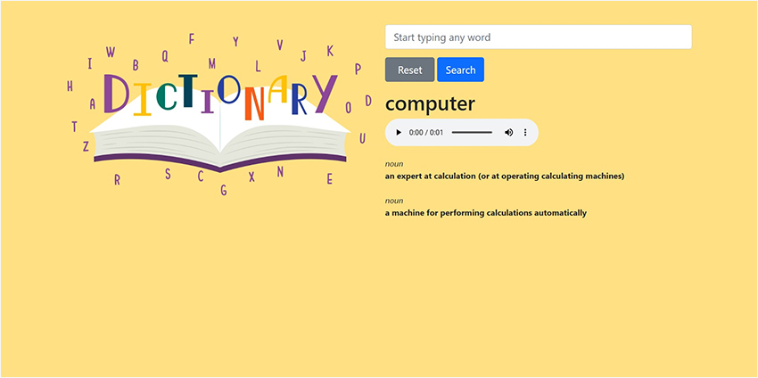
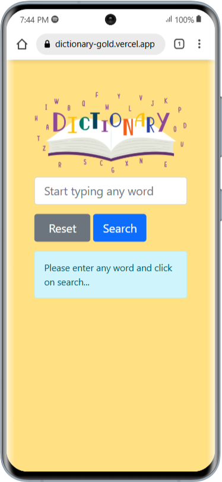
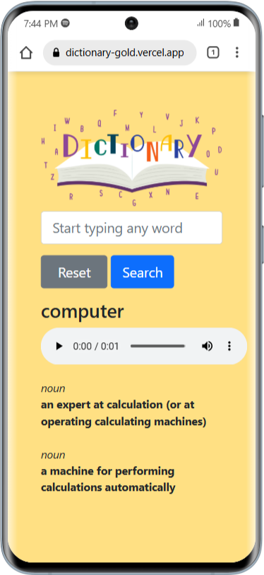

# Dictionary
Dictionary Project was developed with Django, this application provides word meanings across different parts of speech along with pronunciations.

With this dictionary project, you'll gain practical knowledge on how to utilize APIs to retrieve word meanings across different parts of speech along with pronunciations, enhancing your understanding of API integration in real-world applications.

## Installing
### Clone the project

```bash
git clone https://github.com/shivatejaburle/dictionary
cd dictionary
```

### Setup your Virtual Environment
```bash
pip install virtualenv
virtualenv venv
# For Windows
venv\Scripts\activate   
# For Mac
source venv/bin/activate 
```

### Install dependencies
```bash
pip install -r requirements.txt
```

### Environment Settings

Get your API Key from Wordnik: https://developer.wordnik.com/

Create `dictionary/.env` to store API Keys.

```bash
WORDNIK_API_KEY = '<YOUR_API_KEY>'
```

### Collect static files (only on a Production Server)

```bash
python manage.py collectstatic
```

### Running a Development Server

Just run this command:

```bash
python manage.py runserver
```
Your application will be available @ http://127.0.0.1:8000/

## Screenshots


&emsp; &emsp;&emsp;&emsp; 